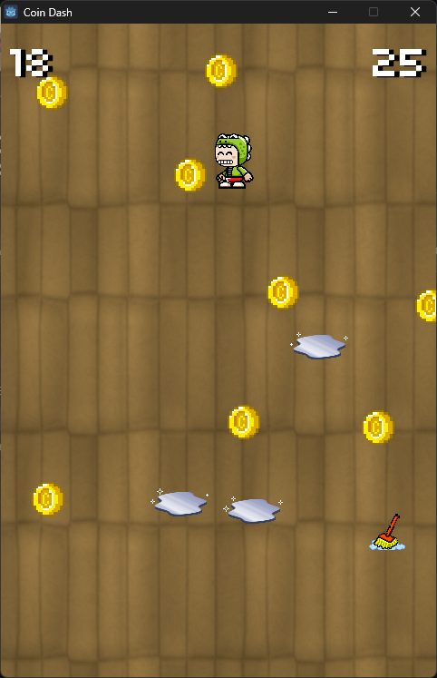

# Coin Dash

## Objective

Collect all the coins to advance to the next round in the allotted time but watch out for the puddles! Use the hour glass and mop to help you on your adventure!

## Assets Used

Thanks to many artists on OpenGameArt.org!

### Images
- [Hourglass](https://opengameart.org/content/animated-hourglass) by Zoedoz released under CC0 
- [Crocodile Mascot](https://opengameart.org/content/bevouliin-free-game-sprites-crocodile-mascot-running-and-jumping-boy-game-character) by bevoulin released CC0
- [Ice Patch Effect](https://opengameart.org/content/ice-patch-effect) used as puddles by dorkster released under CC-BY-SA 3.0
- Mop created in [Aesprite](https://github.com/aseprite/aseprite) by cfultz. Inspired by [alamy mop](https://www.alamy.com/vector-pixel-art-mop-isolated-cartoon-image362289110.html)
- [Wood Floor](https://opengameart.org/content/wood-floor) by DavidRStudios released under CC0
- [Animated Coin](https://opengameart.org/content/rotating-coin) by Puddin released under CC0

### Music 

- [Railgun Rain](https://opengameart.org/content/railgun-rain) level music by northivanastan released under CC0

### Fonts

- [Kenney Fonts] by Kennel.nl released under CC0
